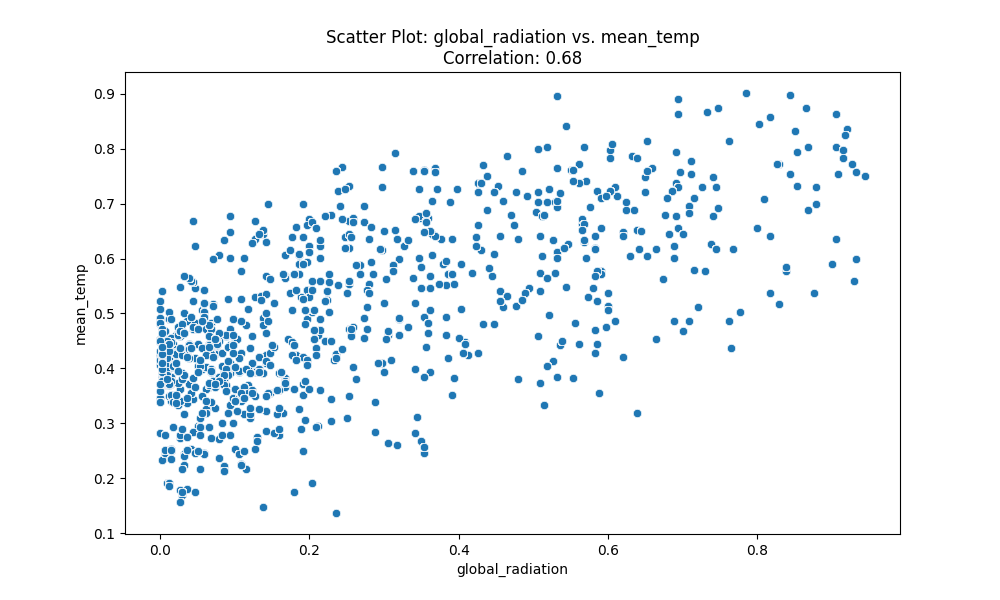
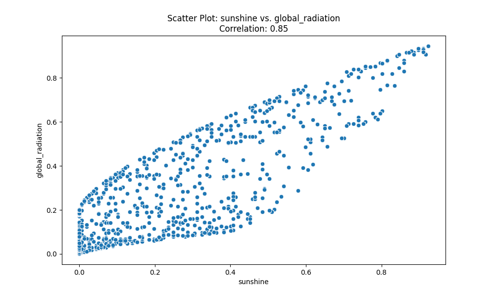

# Analysis of the Impact of Weather on Energy Consumption in London Households

## Author

Marco Narcisi

## **Executive Summary**

This report uncovers the intricate relationship between weather patterns and household energy consumption in London, leveraging a comprehensive dataset collected through smart meters from the Low Carbon London project, coupled with meteorological data from a nearby weather station. The interplay between environmental factors and energy demands offers crucial insights for energy management and addresses the need for efficient energy consumption to counterbalance carbon footprints.

## **Introduction**

Understanding energy consumption patterns against the backdrop of fluctuating weather conditions is essential for environmental sustainability and economic efficiency. This analysis aims to unravel the correlation between weather variables and household energy consumption, providing stakeholders, including energy companies, policymakers, and consumers, with evidence-based insights for improved energy resource management.

## **Data Description**

The smart meters dataset encapsulates daily energy consumption readings from 5,567 households in London, spanning from November 2011 to February 2014, painting a comprehensive picture of residential energy usage. Simultaneously, the weather dataset offers a detailed look at daily weather conditions, including temperature readings, solar radiation levels, cloud coverage, and other critical indicators, synchronized with the same period.

## **Data Preprocessing**

In preparing the datasets for analysis, several precautionary steps were undertaken. Discrepancies where the maximum daily temperature fell below the minimum were corrected through a systematic swap. Weather data was normalized to ensure equitable influence across metrics. Finally, the two datasets were merged based on the common 'date' field, creating a single, unified source of data for intricate analysis.

## **Exploratory Data Analysis (EDA)**

Initial exploration revealed distinct seasonal patterns in energy use, with notable peaks and troughs corresponding to changes in weather. Histograms illustrated energy consumption's skewed distribution, while line charts captured temporal trends, signaling the influence of environmental factors on energy demands.

## **Correlation Analysis**

The crux of the report lies in the robust correlation analysis conducted across various metrics. Energy consumption measurements, namely median, mean, max, min, and sum, were highly inter-correlated, indicating consistent daily patterns. A high correlation between solar radiation and mean temperatures underlines the paramount impact of sunshine on energy usage. In contrast, inverse correlations, such as between cloud cover and sunshine, validate the expected natural phenomena.

## **Scatter Plot Visualizations**

A series of scatter plots, impeccably labeled and cataloged, elucidate the associations between strongly correlated variables. For instance, "Scatter Plot: Energy Median vs. Energy Mean" unveils the linear dependency between median and mean energy consumption, with a correlation coefficient of 0.930593, suggesting that days with overall higher energy usage also tend to register increased average consumption rates.

In a similar vein, Scatter Plot: "Global Radiation vs. Mean Temperature" compares global radiation against mean temperature, with a correlation magnitude of 0.680240, corroborating that sunnier days typically lead to higher temperatures and potentially reduced energy consumption for heating.

## **Key Findings and Insights**

Our analysis confirms multiple intuitive and some unexpected correlations within the energy and weather datasets. For instance, solar radiation bears substantial influence on the heating and cooling needs within households, reflected in their energy consumption patterns.

## **Conclusions and Recommendations**

In conclusion, the weather variables exhibit a significant impact on household energy consumption. These findings endorse the implementation of weather-adaptive energy management systems and highlight the importance of incorporating weather forecasts into energy demand planning.

As a recommendation, future research could embrace predictive modeling to anticipate energy demand based on specific weather forecasts. Additionally, further analysis incorporating humidity and wind speed might yield additional insights.

## **Appendix**

**Scatter Plot: Energy Median vs. Energy Mean**

This plot illustrates a strong linear relationship between daily median and mean energy consumption, with a high correlation coefficient of 0.93. The tight clustering along a diagonal line suggests that days with median energy usage accurately predict mean energy usage, which could inform daily demand forecasts.

<div>

</div>

**Scatter Plot: Energy Median vs. Energy Max**

The graph highlights a moderate correlation between the median and maximum daily energy consumption readings, with a correlation coefficient of 0.57. This correlation indicates that higher median energy usage moderately predicts peak energy demand within a day.

<div>

</div>

**Scatter Plot: Global Radiation vs. Mean Temperature**

This visualization depicts a substantial correlation (0.68) between global radiation and mean daily temperature, underscoring the impact of solar exposure on ambient temperatures and possibly the heating and cooling energy requirements of households.

<div>

</div>

**Scatter Plot: Cloud Cover vs. Sunshine**

The plot shows an inverse relationship between cloud cover and sunshine duration, with a correlation coefficient of -0.81. The scatter indicates that increased cloudiness significantly reduces the amount of sunshine reaching the earth's surface, which potentially impacts energy needs.

<div>

</div>

**Scatter Plot: Sunshine vs. Global Radiation**

Here, the correlation between hours of sunshine and global radiation is evident, with a correlation coefficient of 0.85. This strong positive correlation reveals that sunny days typically experience higher levels of solar radiation, directly influencing temperature and energy consumption for cooling.

<div>

</div>

**Python code**

```python
import pandas as pd
from sklearn.preprocessing import MinMaxScaler
import seaborn as sns
import matplotlib.pyplot as plt

# Load and preprocess the weather data
weather_df = pd.read_csv('london_weather.csv')
weather_df['date'] = pd.to_datetime(weather_df['date'], format='%Y%m%d')
weather_df.loc[weather_df['max_temp'] < weather_df['min_temp'], ['min_temp', 'max_temp']] = \
    weather_df.loc[weather_df['max_temp'] < weather_df['min_temp'], ['max_temp', 'min_temp']].values
weather_cols_to_normalize = ['cloud_cover', 'sunshine', 'global_radiation', 'max_temp', 'mean_temp', 'min_temp', 'precipitation', 'pressure', 'snow_depth']
scaler = MinMaxScaler()
weather_df[weather_cols_to_normalize] = scaler.fit_transform(weather_df[weather_cols_to_normalize])
weather_df.dropna(inplace=True)

# Load and preprocess the smart meters data
smart_meters_df = pd.read_csv('smart_meters.csv')
smart_meters_df['day'] = pd.to_datetime(smart_meters_df['day'], format='%Y-%m-%d')
smart_meters_df.drop(columns=['energy_std'], inplace=True)
smart_meters_df.dropna(inplace=True)

# Merge the datasets
smart_meters_df.set_index('day', inplace=True)
weather_df.set_index('date', inplace=True)
merged_df = smart_meters_df.join(weather_df, how='inner').reset_index()
merged_df.rename(columns={'index': 'date'}, inplace=True)

# Correlation analysis
numeric_cols = merged_df.select_dtypes(include=['float64', 'int64']).columns
correlation_matrix = merged_df[numeric_cols].corr()

# Scatter plot generation for strongly correlated pairs
strong_correlation_threshold = 0.5
strong_correlations = correlation_matrix.abs().stack().reset_index()
strong_correlations.columns = ['Variable_1', 'Variable_2', 'Correlation']
strong_correlations = strong_correlations[
    (strong_correlations['Correlation'] > strong_correlation_threshold) & 
    (strong_correlations['Variable_1'] != strong_correlations['Variable_2'])
]
strong_correlations.drop_duplicates(subset=['Variable_1', 'Variable_2'], inplace=True)
for index, row in strong_correlations.iterrows():
    sns.scatterplot(data=merged_df, x=row['Variable_1'], y=row['Variable_2'])
    plt.title(f"{row['Variable_1']} vs {row['Variable_2']} Correlation: {row['Correlation']:.2f}")
    plt.savefig(f"{row['Variable_1']}_vs_{row['Variable_2']}_scatter.png")
    plt.close()

# Save correlation coefficients and summary statistics to a CSV file
summary_statistics = pd.DataFrame(columns=['Variable_1', 'Variable_2', 'Correlation', 'Mean_1', 'Std_1', 'Mean_2', 'Std_2'])
for _, row in strong_correlations.iterrows():
    summary_statistics = summary_statistics.append({
        'Variable_1': row['Variable_1'],
        'Variable_2': row['Variable_2'],
        'Correlation': row['Correlation'],
        'Mean_1': merged_df[row['Variable_1']].mean(),
        'Std_1': merged_df[row['Variable_1']].std(),
        'Mean_2': merged_df[row['Variable_2']].mean(),
        'Std_2': merged_df[row['Variable_2']].std()
    }, ignore_index=True)
summary_statistics.to_csv('summary_statistics.csv', index=False)
```

**Data Sources**

The datasets used in this analysis were sourced from the following providers under their respective licenses:

1. **London Weather Data:**
   
   - Data provided by Emmanuel F. Werr, available at Kaggle: [London Energy Data](https://www.kaggle.com/datasets/emmanuelfwerr/london-homes-energy-data).
   - License: CC0 1.0 Universal (CC0 1.0) Public Domain Dedication.

2. **Smart Meters in London:**
   
   - Data provided by Jean-Michel D., available at Kaggle: [Smart meters in London](https://www.kaggle.com/datasets/jeanmidev/smart-meters-in-london).
   - License: Open Data Commons Open Database License (ODbL) v1.0.
